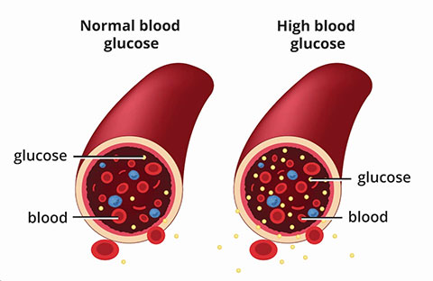
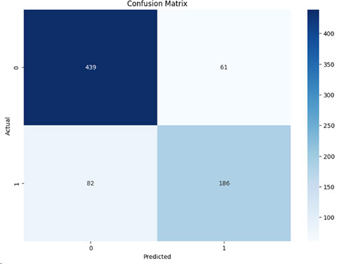
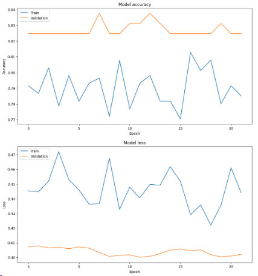

# What Is Diabetes?

  

Diabetes is a disease that occurs when your blood glucose, also called blood sugar, is too high. Glucose is your body’s main source of energy. Your body can make glucose, but glucose also comes from the food you eat.

Insulin is a hormone made by the pancreas that helps glucose get into your cells to be used for energy. If you have diabetes, your body doesn’t make enough—or any—insulin, or doesn’t use insulin properly. Glucose then stays in your blood and doesn’t reach your cells.

Diabetes raises the risk for damage to the eyes, kidneys, nerves, and heart. Diabetes is also linked to some types of cancer. Taking steps to prevent or manage diabetes may lower your risk of developing diabetes health problems. 
(From the National Institute of Diabetes and Digestive and Kidney Diseases: https://www.niddk.nih.gov/health-information/diabetes/overview/what-is-diabetes)

  

# A model to predict Diabetes

We can implement a supervised machine learning model to predict Diabetes using Neural Networks. In our scenario, we use the Pima Indian dataset. This dataset is comprised of a female population belonging to the Pima reservation.
We an use other datasets and tweak the model to improve its Precision.

The model was implemented using the adam optimizer.

# Results

## -Overall Accuracy:  81.38%
## -Overall Precision: 79.78%
## -Overall Recall:    78.60%
## -Overall F1-Score:  79.11%

  

  

# Improving Results

We obtained 81.38% efficiency which is a great start but not good enough.

We can try:

hyperparamter tunning,
handling imbalanced data (use SMOTE, XGBoost, LightGBM),
Apply regularization techniques (L1 or L2 to prevent overfitting) and find balance between bias and variance,
Cross Validation
Emsemble Learning
